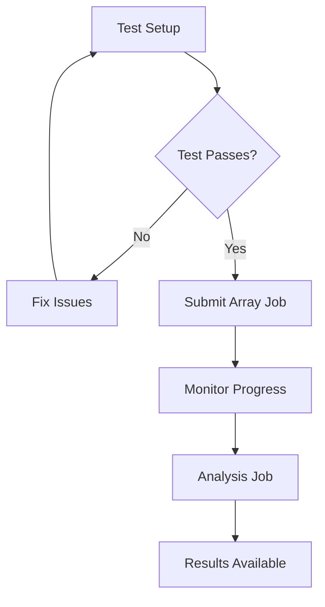

# EVEREST Production Training - Cluster Setup

This directory contains PBS scripts for running EVEREST production training on cluster systems.

## 🎯 Overview

The production training system trains EVEREST models across all 9 flare class × time window combinations (C/M/M5 × 24h/48h/72h) with 5 random seeds each for statistical robustness. This results in 45 total experiments.

## 📁 Files

```
cluster/
├── submit_jobs.sh                    # Main job submission script
├── submit_production_array.pbs       # Array job script (45 experiments)
├── submit_analysis.pbs              # Analysis job (runs after array completes)
├── test_production_training.pbs     # Comprehensive test script
├── monitor_production.sh            # Job monitoring utilities
├── HOW_TO_CHECK_LOGS.md            # Log analysis guide
└── README.md                       # This file
```

## 🚀 Quick Start

### 1. Test the Setup First

**ALWAYS run the test script before submitting the full array job:**

```bash
cd models/training/cluster
qsub test_production_training.pbs
```

Wait for the test to complete and check the log:
```bash
cat test_production_training.log
```

The test validates:
- ✅ Project structure and file locations
- ✅ Environment setup (conda, GPU)
- ✅ Module imports (EVEREST, training components)
- ✅ Data availability
- ✅ Array job functionality
- ✅ Model creation and basic training

### 2. Submit Production Training Jobs

If the test passes, submit the full training array:

```bash
# Submit all 45 experiments
./submit_jobs.sh

# Or with specific targets only
./submit_jobs.sh --targets C-24 M-48 M5-72

# Or dry-run first to see what would be submitted
./submit_jobs.sh --dry-run
```

### 3. Monitor Progress

```bash
# Check job status
qstat -u $USER

# Monitor in real-time
./monitor_production.sh watch

# Check specific job details
./monitor_production.sh details 1
```

## 🔧 Configuration

### Resource Requirements
- **Per Job**: 1 GPU (L40S), 8 cores, 64GB RAM
- **Time Limit**: 24 hours per job
- **Total Jobs**: 45 (array job)
- **Expected Runtime**: ~18-24 hours (parallel execution)
- **Storage**: ~50GB total

### Environment Requirements
- **Conda Environment**: `everest_env`
- **GPU**: Required (L40S or equivalent)
- **Python**: 3.8+ with PyTorch, scikit-learn, pandas
- **Data**: Nature_data/ directory with SHARP datasets

## 📊 Experiment Configuration

### Training Targets (9 total)
```
C-24h   C-48h   C-72h
M-24h   M-48h   M-72h
M5-24h  M5-48h  M5-72h
```

### Random Seeds (5 per target)
```
Seeds: 0, 1, 2, 3, 4
```

### Array Job Mapping
```
Jobs 1-5:   C-24h  (seeds 0-4)
Jobs 6-10:  C-48h  (seeds 0-4)
Jobs 11-15: C-72h  (seeds 0-4)
Jobs 16-20: M-24h  (seeds 0-4)
Jobs 21-25: M-48h  (seeds 0-4)
Jobs 26-30: M-72h  (seeds 0-4)
Jobs 31-35: M5-24h (seeds 0-4)
Jobs 36-40: M5-48h (seeds 0-4)
Jobs 41-45: M5-72h (seeds 0-4)
```

## 📋 Output Structure

### Results Directory
```
models/training/
├── results/                     # Experiment results
│   ├── everest_C_24h_seed0/
│   │   ├── results.json         # Complete results
│   │   ├── training_history.csv # Training metrics
│   │   ├── threshold_optimization.csv
│   │   └── final_metrics.csv
│   └── ...
├── trained_models/              # Model weights
│   ├── everest_C_24h_seed0/
│   │   └── model_weights.pt
│   └── ...
├── logs/                        # Training logs
├── analysis/                    # Statistical analysis
└── plots/                       # Visualizations
```

### Log Files
```
logs/
├── production_1.log            # Array job 1 log
├── production_2.log            # Array job 2 log
└── ...                         # Logs for jobs 1-45
```

## 🐛 Troubleshooting

### Common Issues

#### 1. Test Script Fails
```bash
# Check the test log
cat test_production_training.log

# Common issues:
# - Missing conda environment
# - GPU not available
# - Data files missing
# - Import errors
```

#### 2. Array Jobs Fail
```bash
# Check individual job logs
cat logs/production_*.log

# Check job status
qstat -u $USER

# Use monitoring script
./monitor_production.sh summary
```

#### 3. Environment Issues
```bash
# Verify conda environment exists
conda env list | grep everest

# Test environment manually
conda activate everest_env
python -c "import torch; print(torch.cuda.is_available())"
```

#### 4. Data Issues
```bash
# Verify data files exist
ls Nature_data/training_data_*.csv
ls Nature_data/testing_data_*.csv

# Check data loading
python -c "from models.utils import get_training_data; print(get_training_data('72', 'M5')[0].shape)"
```

#### 5. Import Issues
```bash
# Verify project structure
ls models/solarknowledge_ret_plus.py
ls models/training/trainer.py

# Test imports from project root
cd /path/to/project
python -c "from models.training.config import TRAINING_TARGETS; print(len(TRAINING_TARGETS))"
```

## 🎛️ Advanced Usage

### Submit Specific Experiments Only
```bash
# Submit only C-class experiments
./submit_jobs.sh --targets C-24 C-48 C-72

# Submit only M5-class experiments  
./submit_jobs.sh --targets M5-24 M5-48 M5-72
```

### Manual Job Submission
```bash
# Submit array job directly
qsub -J 1-45 submit_production_array.pbs

# Submit analysis job after array completes
qsub -W depend=afterokarray:$ARRAY_JOB_ID submit_analysis.pbs
```

### Re-run Failed Jobs
```bash
# Check which jobs failed
./monitor_production.sh summary

# Re-submit specific job indices
qsub -J 23 submit_production_array.pbs  # Re-run job 23 only
```

## 📈 Expected Results

### Performance Ranges (Based on Preliminary Testing)
- **TSS**: 0.3-0.8 (varies by target difficulty)
- **F1**: 0.2-0.7 (class imbalance dependent)
- **Accuracy**: 0.95+ (high due to class imbalance)
- **ROC AUC**: 0.7-0.95
- **Latency**: 1-5 ms per sample

### Training Times
- **Per Model**: 12-20 hours (300 epochs with early stopping, enhanced resources)
- **Full Study**: ~18-24 hours (parallel execution)
- **Analysis**: ~30 minutes

## 🔗 Related Files

- **Training Configuration**: `../config.py`
- **Training Logic**: `../trainer.py`
- **Orchestration**: `../run_production_training.py`
- **Analysis**: `../analysis.py`

## 📞 Support

If you encounter issues:

1. **Check the test script output first**
2. **Review job logs in `logs/`**
3. **Use monitoring script for diagnostics**
4. **Verify environment and data availability**
5. **Check the main training README**: `../README.md`

## 🔄 Workflow Summary



1. **Test**: `qsub test_production_training.pbs`
2. **Submit**: `./submit_jobs.sh`
3. **Monitor**: `./monitor_production.sh watch`
4. **Results**: Check `models/training/results/`

---

**Note**: This production training represents the final evaluation phase of EVEREST development, providing publication-ready results with comprehensive statistical analysis and threshold optimization. 

echo "🎯 Expected completion time: ~18-24 hours (parallel execution)"
echo "💾 Expected storage usage: ~50GB" 